# Java Web Application - CI/CD Pipeline

A Java web application with automated CI/CD pipeline using Jenkins, SonarQube, Nexus, and Tomcat.

## Table of Contents
- [Pipeline Overview](#pipeline-overview)
- [Pipeline Stages](#pipeline-stages)
- [Architecture](#architecture)
- [E2E Setup Guide](#e2e-setup-guide)
  - [1. Jenkins Master Setup](#1-jenkins-master-setup)
  - [2. Jenkins Agents Setup](#2-jenkins-agents-setup)
  - [3. SonarQube Setup](#3-sonarqube-setup)
  - [4. Nexus Repository Setup](#4-nexus-repository-setup)
  - [5. Tomcat Deployment Server Setup](#5-tomcat-deployment-server-setup)
  - [6. Jenkins Configuration](#6-jenkins-configuration)
- [Running the Pipeline](#running-the-pipeline)
- [Application Endpoints](#application-endpoints)
- [Monitoring](#monitoring)
- [Local Development](#local-development)

## Pipeline Overview

The Jenkins pipeline automates the complete software delivery process from code checkout to production deployment:

```
GitHub → Build & Test → Code Quality → Package → Store → Deploy to Tomcat
```

## Pipeline Stages

| # | Stage | Agent | Description |
|---|-------|-------|-------------|
| 1 | Checkout Code | sonar | Clone repository from GitHub (`main` branch) |
| 2 | SonarQube Analysis | sonar | Static code analysis and quality gates (`mvn clean verify sonar:sonar`) |
| 3 | Build Artifact | sonar | Build WAR file (`mvn clean package -DskipTests`) |
| 4 | Upload to Nexus | sonar | Store artifact in Nexus repository via cURL |
| 5 | Deploy to Tomcat | tomcat | Download from Nexus and deploy using Tomcat Manager API |

## Architecture

### Infrastructure Components
- **Jenkins Master**: Orchestrates pipeline execution
- **Jenkins Agent (sonar)**: Build, test, and package stages (stages 1-4)
- **Jenkins Agent (tomcat)**: Deployment stage (stage 5)
- **SonarQube Server**: Code quality analysis
- **Nexus Repository**: Artifact storage
- **Tomcat Server**: Application deployment target

**Tech Stack:**
- **Application**: Java Servlet/JSP with Maven
- **CI/CD**: Jenkins pipeline with multi-agent setup
- **Quality Gate**: SonarQube static code analysis
- **Artifact Repository**: Nexus Repository Manager
- **Deployment Target**: Apache Tomcat 9.x+

### Environment Variables (in Jenkinsfile)

```groovy
SONARQUBE_SERVER = 'sonar'
MVN_SETTINGS = '/etc/maven/settings.xml'
NEXUS_URL = 'http://3.19.221.46:8081'
NEXUS_REPO = 'my-java-app'
NEXUS_GROUP = 'com/web/app'
NEXUS_ARTIFACT = 'my-app'
TOMCAT_URL = 'http://18.116.203.32:8080/manager/text'
```

---

## E2E Setup Guide

### 1. Jenkins Master Setup

#### Install Jenkins on Ubuntu/Debian

```bash
# Install Java
sudo apt update
sudo apt install fontconfig openjdk-21-jre

# Add Jenkins repository
sudo wget -O /etc/apt/keyrings/jenkins-keyring.asc \
  https://pkg.jenkins.io/debian-stable/jenkins.io-2023.key
echo "deb [signed-by=/etc/apt/keyrings/jenkins-keyring.asc]" \
  https://pkg.jenkins.io/debian-stable binary/ | sudo tee \
  /etc/apt/sources.list.d/jenkins.list > /dev/null

# Install Jenkins
sudo apt update
sudo apt install jenkins -y

# Start Jenkins
sudo systemctl start jenkins
sudo systemctl enable jenkins

# Get initial admin password
sudo cat /var/lib/jenkins/secrets/initialAdminPassword
```

#### Initial Jenkins Configuration

1. Access Jenkins: `http://<jenkins-server-ip>:8080`
2. Use initial admin password to unlock
3. Install suggested plugins
4. Create admin user
5. Configure Jenkins URL

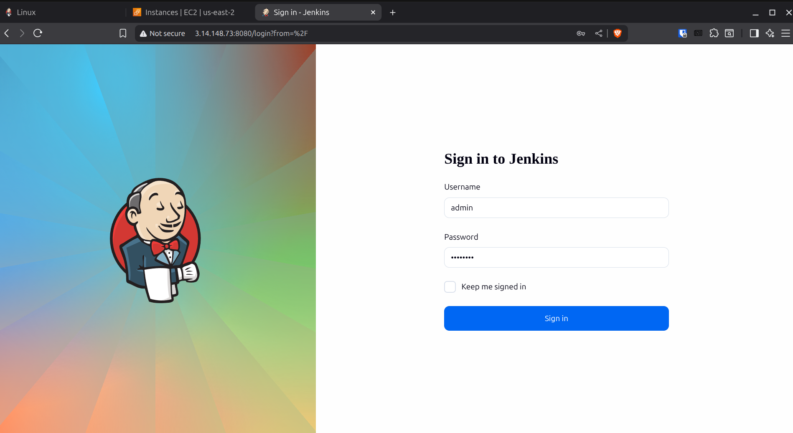


#### Install Required Plugins

```
Manage Jenkins → Plugins → Available plugins
```

Install these plugins:
- Git
- Pipeline
- Credentials Binding
- SSH Agent
- Maven Integration
- SonarQube Scanner

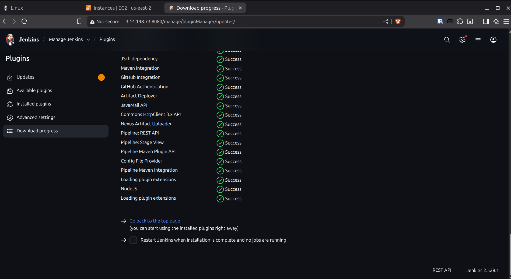

After installation, configure tools:
```
Manage Jenkins → Tools → JDK installations
- Name: JDK17
- JAVA_HOME: /usr/lib/jvm/java-17-openjdk-amd64

Manage Jenkins → Tools → Maven installations
- Name: maven
- MAVEN_HOME: /usr/share/maven

```


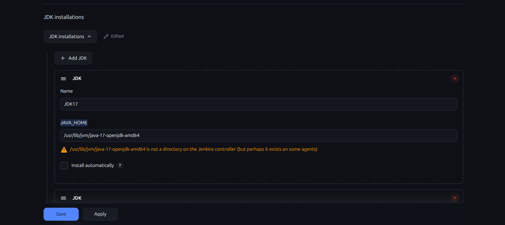


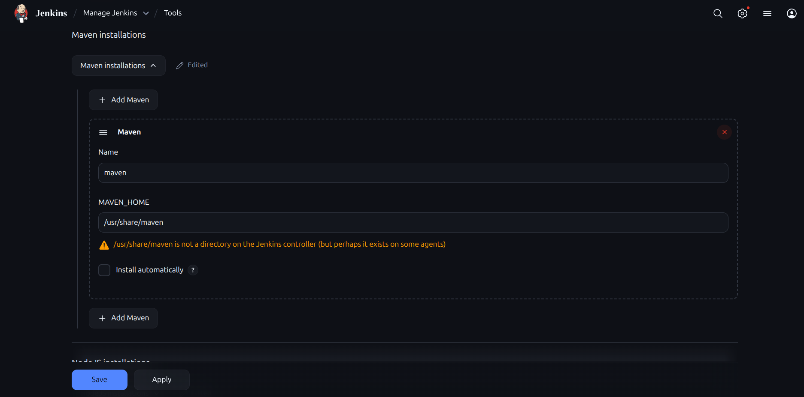

### 2. Jenkins Agents Setup

#### Agent 1: `sonar` (Build Agent)

**On Agent Machine:**

```bash
# Install Java
sudo apt update
sudo apt install openjdk-17-jdk -y

# Install Maven
sudo apt install maven -y

# Install required tools
sudo apt install git curl -y

# Create Jenkins user
sudo useradd -m -s /bin/bash jenkins

# Create workspace directory
sudo mkdir -p /home/jenkins/workspace
sudo chown -R jenkins:jenkins /home/jenkins

# Create Maven settings directory
sudo mkdir -p /etc/maven
sudo chown -R jenkins:jenkins /etc/maven

# Generate SSH key for Jenkins master (run on Jenkins master)
ssh-keygen -t rsa -b 4096 -f ~/.ssh/jenkins_sonar_key -N ""

# Copy public key to agent (run on Jenkins master)
ssh-copy-id -i ~/.ssh/jenkins_sonar_key.pub jenkins@<sonar-agent-ip>
```

**In Jenkins (Master):**

```
Manage Jenkins → Nodes → New Node
- Node name: sonar
- Type: Permanent Agent
- # of executors: 2
- Remote root directory: /home/jenkins
- Labels: sonar
- Usage: Use this node as much as possible
- Launch method: Launch agents via SSH
  - Host: <sonar-agent-ip>
  - Credentials: Add → SSH Username with private key
    - ID: jenkins-sonar-ssh
    - Username: jenkins
    - Private Key: Enter directly (paste content of ~/.ssh/jenkins_sonar_key)
  - Host Key Verification Strategy: Non verifying Verification Strategy
- Availability: Keep this agent online as much as possible
```

#### Agent 2: `tomcat` (Deployment Agent)

**On Agent Machine:**

```bash
# Install Java
sudo apt update
sudo apt install openjdk-17-jdk -y

# Install required tools
sudo apt install curl -y

# Create Jenkins user
sudo useradd -m -s /bin/bash jenkins

# Create workspace directory
sudo mkdir -p /home/jenkins/workspace
sudo chown -R jenkins:jenkins /home/jenkins

# Grant sudo permissions for deployment
echo "jenkins ALL=(ALL) NOPASSWD: /bin/mkdir, /bin/rm, /bin/curl" | sudo tee /etc/sudoers.d/jenkins
sudo chmod 0440 /etc/sudoers.d/jenkins

# Generate SSH key for Jenkins master (run on Jenkins master)
ssh-keygen -t rsa -b 4096 -f ~/.ssh/jenkins_tomcat_key -N ""

# Copy public key to agent (run on Jenkins master)
ssh-copy-id -i ~/.ssh/jenkins_tomcat_key.pub jenkins@<tomcat-agent-ip>
```

**In Jenkins (Master):**

```
Manage Jenkins → Nodes → New Node
- Node name: tomcat
- Type: Permanent Agent
- # of executors: 1
- Remote root directory: /home/jenkins
- Labels: tomcat
- Usage: Only build jobs with label expressions matching this node
- Launch method: Launch agents via SSH
  - Host: <tomcat-agent-ip>
  - Credentials: Add → SSH Username with private key
    - ID: jenkins-tomcat-ssh
    - Username: jenkins
    - Private Key: Enter directly (paste content of ~/.ssh/jenkins_tomcat_key)
  - Host Key Verification Strategy: Non verifying Verification Strategy
```

### 3. SonarQube Setup

#### Install SonarQube

Run this script with root permissions:

```bash
#!/bin/bash
set -e

# Update system
apt-get update
apt-get upgrade -y

# Install Java 17
apt-get install -y openjdk-17-jdk
java -version

# Create sonarqube system user
useradd -m -s /bin/bash sonarqube || true

# Create directories
mkdir -p /opt/sonarqube
mkdir -p /var/sonarqube-data
chown -R sonarqube:sonarqube /opt/sonarqube
chown -R sonarqube:sonarqube /var/sonarqube-data

# Download and install SonarQube
cd /tmp
wget https://binaries.sonarsource.com/Distribution/sonarqube/sonarqube-10.6.0.92116.zip
apt-get install -y unzip
unzip sonarqube-10.6.0.92116.zip
mv sonarqube-10.6.0.92116 /opt/sonarqube/sonarqube
rm sonarqube-10.6.0.92116.zip

chown -R sonarqube:sonarqube /opt/sonarqube

# Configure SonarQube properties (embedded H2 database)
cat > /opt/sonarqube/sonarqube/conf/sonar.properties <<EOF
sonar.web.host=0.0.0.0
sonar.web.port=9000
sonar.path.data=/var/sonarqube-data/data
sonar.path.logs=/var/sonarqube-data/logs
sonar.path.temp=/var/sonarqube-data/temp
EOF

# Increase system limits for SonarQube
echo "sonarqube - nofile 65536" >> /etc/security/limits.conf
echo "sonarqube - nproc 4096" >> /etc/security/limits.conf

# Set kernel parameters for Elasticsearch
sysctl -w vm.max_map_count=524288
echo "vm.max_map_count=524288" >> /etc/sysctl.conf

# Create systemd service
cat > /etc/systemd/system/sonarqube.service <<EOF
[Unit]
Description=SonarQube
After=network.target

[Service]
Type=forking
ExecStart=/opt/sonarqube/sonarqube/bin/linux-x86-64/sonar.sh start
ExecStop=/opt/sonarqube/sonarqube/bin/linux-x86-64/sonar.sh stop
User=sonarqube
Group=sonarqube
Restart=on-failure

[Install]
WantedBy=multi-user.target
EOF

# Enable and start SonarQube
systemctl daemon-reload
systemctl enable sonarqube
systemctl start sonarqube

echo "SonarQube is starting. Access it at http://<server-ip>:9000 in 2-3 minutes"
echo "Default credentials: admin / admin"
```

#### Generate SonarQube Token

1. Access SonarQube: `http://<sonarqube-ip>:9000`
2. Default credentials: admin/admin (change on first login)
3. Navigate to: My Account → Security → Generate Token
4. Token name: `jenkins`
5. Copy the generated token

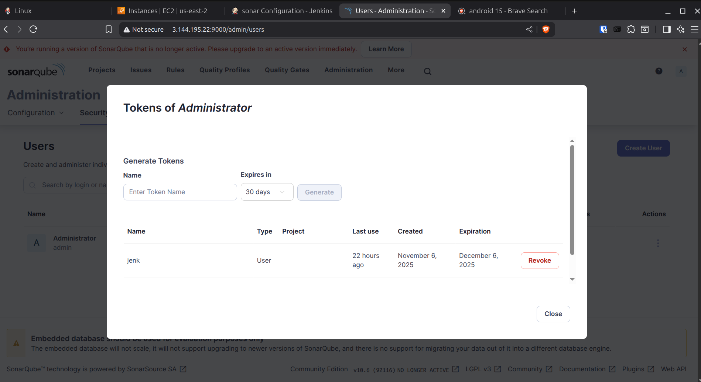


#### Configure in Jenkins

```
Manage Jenkins → System → SonarQube servers
- Name: sonar
- Server URL: http://<sonarqube-ip>:9000
- Server authentication token: Add → Secret text
  - Secret: <paste sonarqube token>
  - ID: sonar-token
  - Description: SonarQube Token
```


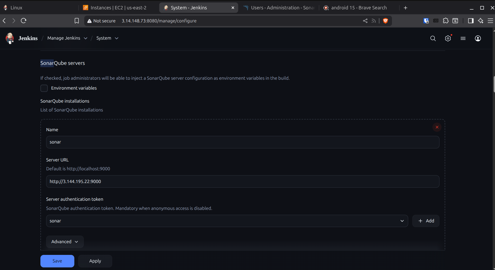

### 4. Nexus Repository Setup

#### Install Nexus

```bash
# Install Java
sudo apt update
sudo apt install openjdk-11-jdk -y

# Download and install Nexus
cd /opt
sudo wget https://download.sonatype.com/nexus/3/latest-unix.tar.gz
sudo tar -xzf latest-unix.tar.gz
sudo mv nexus-3.* nexus

# Create Nexus user
sudo useradd -r -s /bin/bash nexus
sudo chown -R nexus:nexus /opt/nexus
sudo chown -R nexus:nexus /opt/sonatype-work

# Configure Nexus to run as nexus user
echo "run_as_user=\"nexus\"" | sudo tee /opt/nexus/bin/nexus.rc

# Create systemd service
sudo tee /etc/systemd/system/nexus.service << EOF
[Unit]
Description=Nexus Repository Manager
After=network.target

[Service]
Type=forking
LimitNOFILE=65536
ExecStart=/opt/nexus/bin/nexus start
ExecStop=/opt/nexus/bin/nexus stop
User=nexus
Restart=on-abort

[Install]
WantedBy=multi-user.target
EOF

# Start Nexus
sudo systemctl daemon-reload
sudo systemctl start nexus
sudo systemctl enable nexus

# Get initial admin password (after Nexus starts - takes ~2 minutes)
sudo cat /opt/sonatype-work/nexus3/admin.password
```

#### Configure Nexus Repository

1. Access Nexus: `http://<nexus-ip>:8081`
2. Login with admin and initial password
3. Complete setup wizard, set new admin password
4. Create maven2 repository:
   ```
   Settings (gear icon) → Repositories → Create repository
   - Recipe: maven2 (hosted)
   - Name: my-java-app
   - Version policy: Release
   - Layout policy: Strict
   - Deployment policy: Allow redeploy
   - Blob store: default
   ```


#### Add Nexus Credentials to Jenkins

```
Manage Jenkins → Credentials → System → Global credentials → Add Credentials
- Kind: Username with password
- Scope: Global
- Username: admin
- Password: <nexus-password>
- ID: nexus
- Description: Nexus Repository Credentials
```

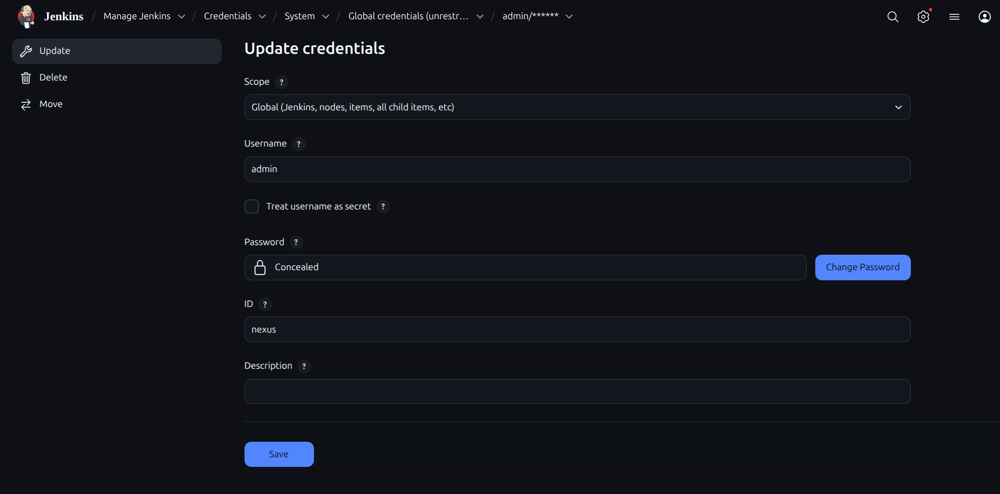


### 5. Tomcat Deployment Server Setup

#### Install Tomcat

```bash
# Install Java
sudo apt update
sudo apt install openjdk-17-jdk -y

# Download Tomcat
cd /opt
sudo wget https://dlcdn.apache.org/tomcat/tomcat-9/v9.0.93/bin/apache-tomcat-9.0.93.tar.gz
sudo tar -xzf apache-tomcat-9.0.93.tar.gz
sudo mv apache-tomcat-9.0.93 tomcat

# Create Tomcat user
sudo useradd -r -s /bin/false tomcat
sudo chown -R tomcat:tomcat /opt/tomcat

# Configure Tomcat users
sudo tee /opt/tomcat/conf/tomcat-users.xml << EOF
<?xml version="1.0" encoding="UTF-8"?>
<tomcat-users xmlns="http://tomcat.apache.org/xml"
              xmlns:xsi="http://www.w3.org/2001/XMLSchema-instance"
              xsi:schemaLocation="http://tomcat.apache.org/xml tomcat-users.xsd"
              version="1.0">
  <role rolename="manager-gui"/>
  <role rolename="manager-script"/>
  <user username="admin" password="admin123" roles="manager-gui,manager-script"/>
</tomcat-users>
EOF

# Create systemd service
sudo tee /etc/systemd/system/tomcat.service << EOF
[Unit]
Description=Apache Tomcat
After=network.target

[Service]
Type=forking
User=tomcat
Group=tomcat
Environment="JAVA_HOME=/usr/lib/jvm/java-17-openjdk-amd64"
Environment="CATALINA_HOME=/opt/tomcat"
Environment="CATALINA_BASE=/opt/tomcat"
ExecStart=/opt/tomcat/bin/startup.sh
ExecStop=/opt/tomcat/bin/shutdown.sh
Restart=on-failure

[Install]
WantedBy=multi-user.target
EOF

# Start Tomcat
sudo systemctl daemon-reload
sudo systemctl start tomcat
sudo systemctl enable tomcat

# Configure firewall
sudo ufw allow 8080/tcp
```

#### Add Tomcat Credentials to Jenkins

```
Manage Jenkins → Credentials → System → Global credentials → Add Credentials
- Kind: Username with password
- Scope: Global
- Username: admin
- Password: <tomcat-password>
- ID: tomcat
- Description: Tomcat Manager Credentials
```

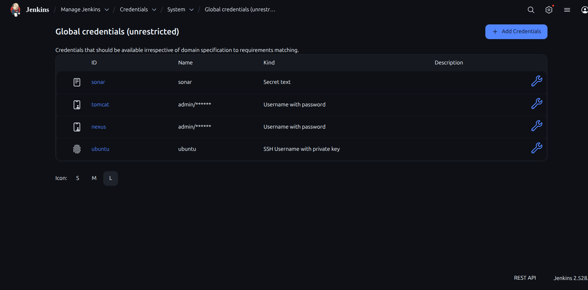


### 6. Jenkins Configuration

#### Create Pipeline Job

```
Jenkins Dashboard → New Item
- Name: sample-java-app
- Type: Pipeline
- Click OK

Configuration:
- Description: CI/CD pipeline for Sample Java Application
- Discard old builds: ✓
  - Strategy: Log Rotation
  - Max # of builds to keep: 10

Pipeline:
- Definition: Pipeline script from SCM
- SCM: Git
  - Repository URL: https://github.com/ashuvee/sample-java-app.git
  - Branch Specifier: */main
  - Credentials: (leave empty for public repo)
- Script Path: Jenkinsfile

Build Triggers (optional):
- GitHub hook trigger for GITScm polling: ✓ (if webhook configured)
- Poll SCM: H/5 * * * * (check every 5 minutes)

Save
```


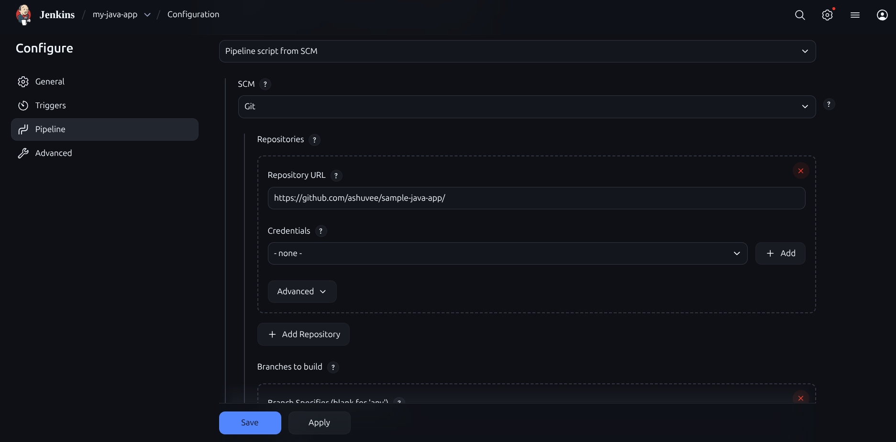


#### Setup GitHub Webhook 


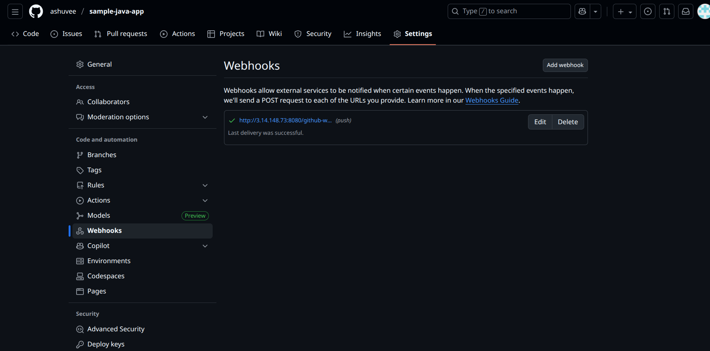


```
GitHub Repository → Settings → Webhooks → Add webhook
- Payload URL: http://<jenkins-url>:8080/github-webhook/
- Content type: application/json
- Which events: Just the push event
- Active: ✓
```

---

## Repository Setup

### GitHub Repository
```
URL: https://github.com/ashuvee/sample-java-app.git
Branch: main
```

### Project Structure
```
sample-java-app/
├── Jenkinsfile              # CI/CD pipeline definition
├── pom.xml                  # Maven build configuration
├── src/main/
│   ├── java/com/example/webapp/
│   │   ├── HelloServlet.java
│   │   ├── UserServlet.java
│   │   └── User.java
│   └── webapp/
│       ├── WEB-INF/web.xml
│       ├── css/style.css
│       ├── index.jsp
│       └── users.jsp
└── src/test/java/

---

## Running the Pipeline

### Manual Trigger
```
Jenkins → sample-java-app → Build Now
```

### Automatic Trigger (Git Push)
```bash
git add .
git commit -m "feature: your changes"
git push origin main
```

### What Happens

1. Jenkins detects push to main branch
2. Pipeline executes on `sonar` agent
3. Code analyzed with SonarQube
4. WAR file built and uploaded to Nexus with version `0.0.${BUILD_NUMBER}`
5. Execution switches to `tomcat` agent
6. Latest WAR downloaded from Nexus
7. Old version undeployed from Tomcat (if exists)
8. New version deployed to Tomcat
9. Application live at: `http://18.116.203.32:8080/my-app/`

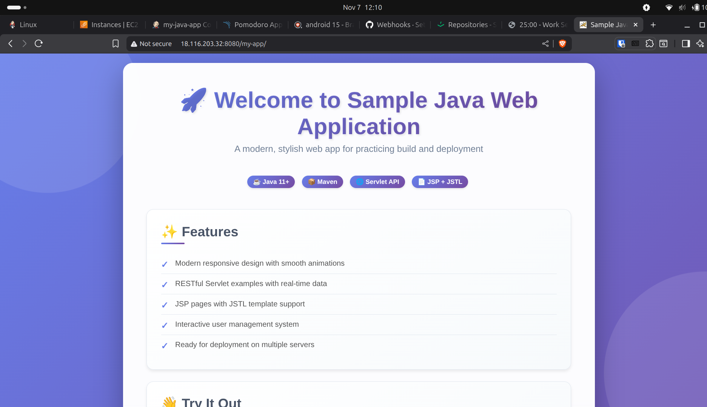

### Versioning

Artifacts are versioned using Jenkins build number:
```
Format: 0.0.${BUILD_NUMBER}
Example: 0.0.42
```

### Artifact Structure

```
Nexus Storage Path:
http://3.19.221.46:8081/repository/my-java-app/
  └── com/web/app/my-app/
      └── 0.0.X/
          └── my-app-0.0.X.war

WAR Contents:
- WEB-INF/
  ├── web.xml
  ├── classes/
  └── lib/
- css/style.css
- index.jsp
- users.jsp
```

---

## Application Endpoints

**Production URL:** `http://18.116.203.32:8080/my-app/`


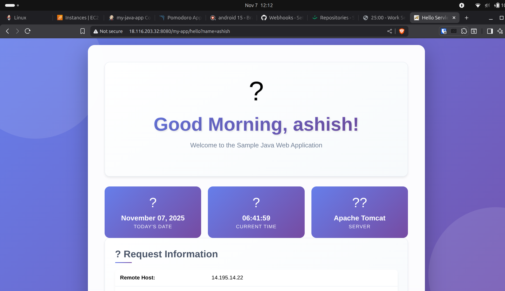

| Endpoint | Description | Example |
|----------|-------------|---------|
| `/` | Home page | `http://18.116.203.32:8080/my-app/` |
| `/hello` | Basic servlet demo | `http://18.116.203.32:8080/my-app/hello` |
| `/hello?name=John` | Personalized greeting | Returns "Hello, John!" |
| `/user` | User management page | View and add users |

---

## Monitoring

### Jenkins Console
- View build logs: `Job → Build #X → Console Output`
- Stage view: Visual pipeline progress
- Build history: Success/failure trends

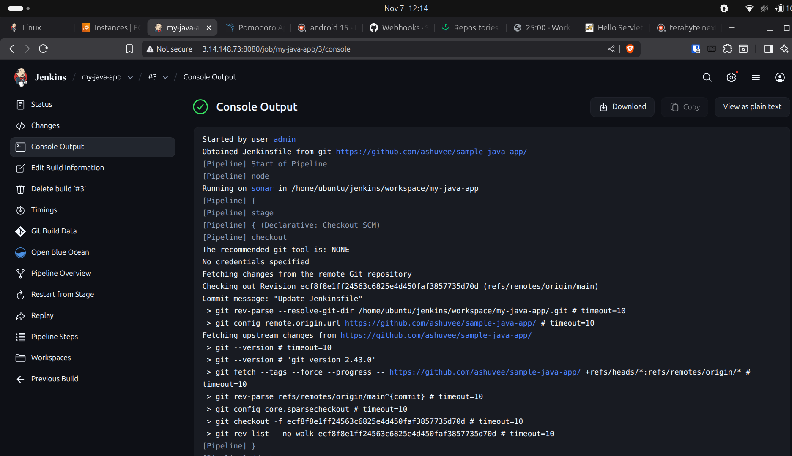

### SonarQube Dashboard
- Code quality metrics
- Code coverage
- Security vulnerabilities
- Code smells and bugs
- Access: `http://<sonarqube-ip>:9000`

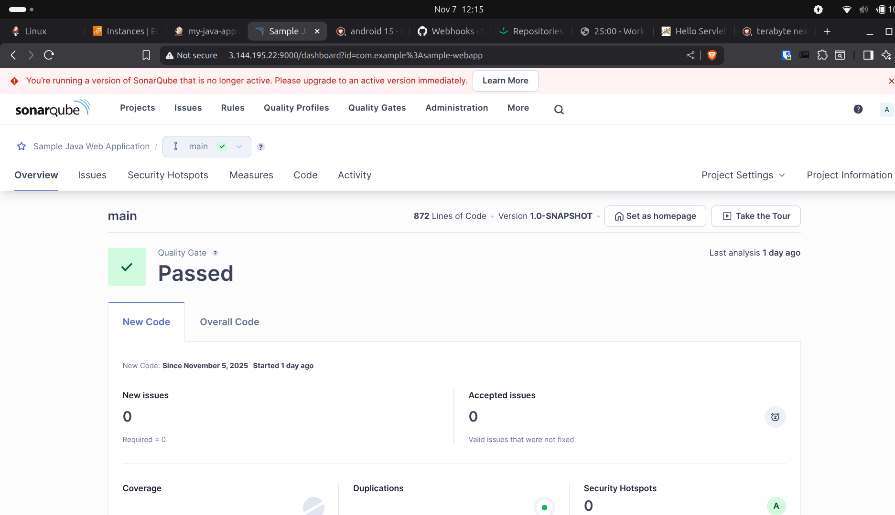


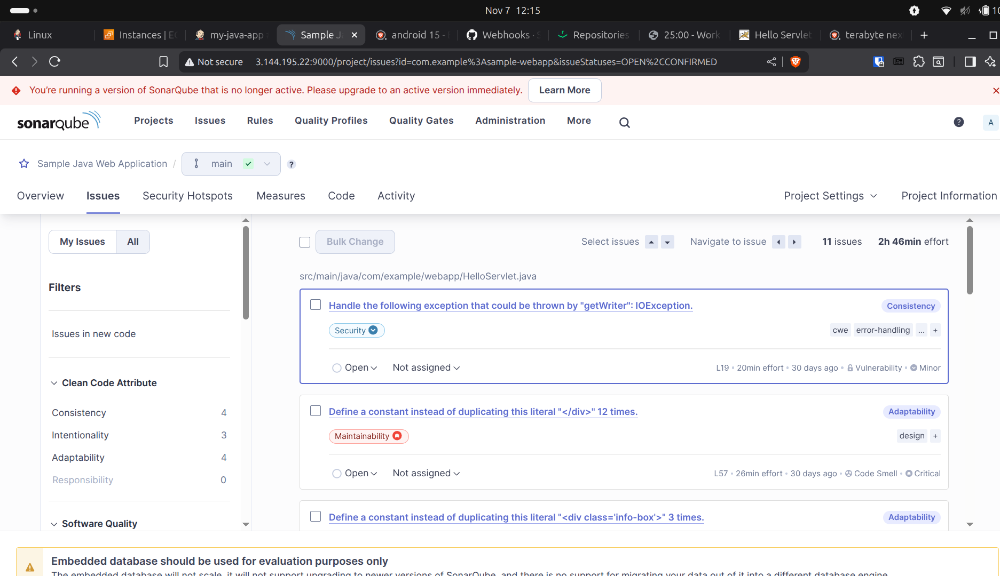

### Nexus Repository
- Browse artifacts: `Browse → my-java-app → com/web/app/my-app`
- Version history
- Download previous versions
- Access: `http://3.19.221.46:8081`

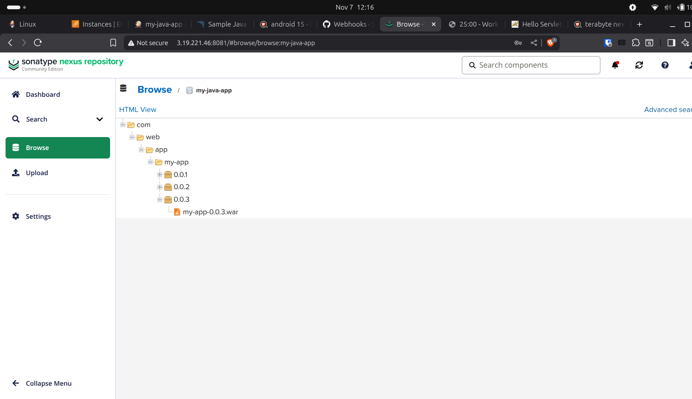

### Tomcat Manager
- Deployed applications list
- Start/stop/undeploy applications
- Application statistics
- Access: `http://18.116.203.32:8080/manager/html`

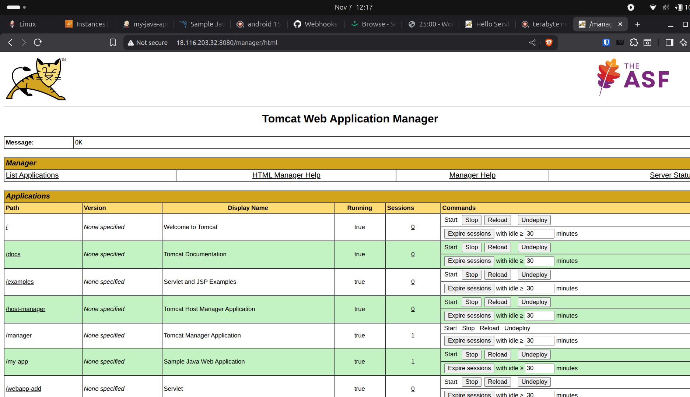

### Verification Commands

```bash
# Check deployment
curl http://18.116.203.32:8080/my-app/

# List deployed apps on Tomcat
curl -u admin:password http://18.116.203.32:8080/manager/text/list

# View latest artifacts in Nexus
curl -u admin:password "http://3.19.221.46:8081/service/rest/v1/search?repository=my-java-app&name=my-app"

# Check Tomcat logs
tail -f /opt/tomcat/logs/catalina.out
```

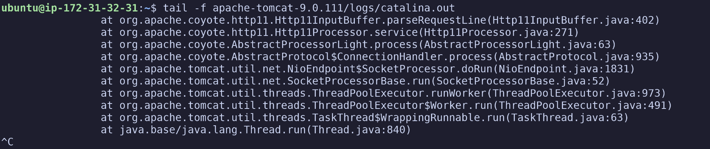

---

## Pipeline Flow Diagram

```
┌──────────────┐
│   GitHub     │
│   (main)     │
└──────┬───────┘
       │
       ▼
┌──────────────────────────────────┐
│     Jenkins Pipeline             │
│     Agent: sonar                 │
├──────────────────────────────────┤
│ 1. Checkout Code                 │
│ 2. SonarQube Analysis            │
│    mvn clean verify sonar:sonar  │
│ 3. Build WAR                     │
│    mvn clean package             │
│ 4. Upload to Nexus               │
│    my-app-0.0.X.war              │
└──────────────┬───────────────────┘
               │
               ▼
┌──────────────────────────────────┐
│   Nexus Repository               │
│   my-java-app/com/web/app/       │
└──────────────┬───────────────────┘
               │
               ▼
┌──────────────────────────────────┐
│     Jenkins Pipeline             │
│     Agent: tomcat                │
├──────────────────────────────────┤
│ 5. Download from Nexus           │
│    Undeploy old version          │
│    Deploy new version            │
└──────────────┬───────────────────┘
               │
               ▼
┌──────────────────────────────────┐
│   Tomcat Server                  │
│   http://18.116.203.32:8080/     │
│   my-app/                        │
└──────────────────────────────────┘
```

---

## Management URLs

| Service | URL | Purpose |
|---------|-----|---------|
| **Production App** | `http://18.116.203.32:8080/my-app/` | Live application |
| **Tomcat Manager** | `http://18.116.203.32:8080/manager/html` | Application management |
| **Nexus Repository** | `http://3.19.221.46:8081` | Artifact repository browser |
| **SonarQube** | `http://<sonarqube-ip>:9000` | Code quality dashboard |
| **Jenkins** | `http://<jenkins-ip>:8080` | CI/CD pipeline monitoring |

---

### Build History

multiple builds (#1, #2, #3)

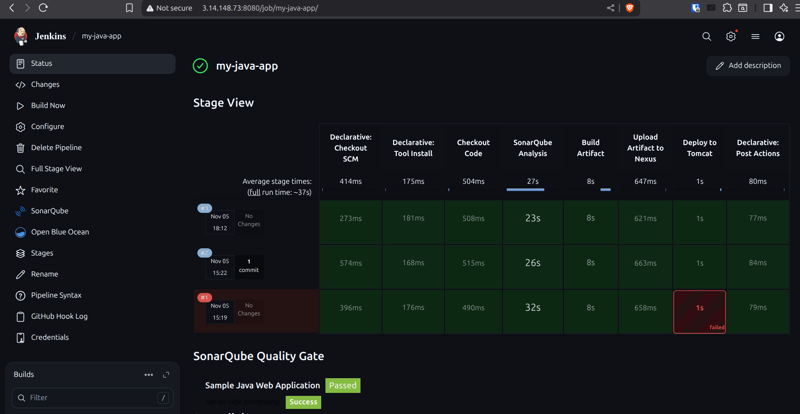


### Jenkins Pipeline Visualization

pipeline completed successfully

Green checkmarks for successful pipeline run


5 stages:

Checkout Code→ SonarQube Analysis→ Build Artifact→ Upload Artifact→ Deploy to Tomcat

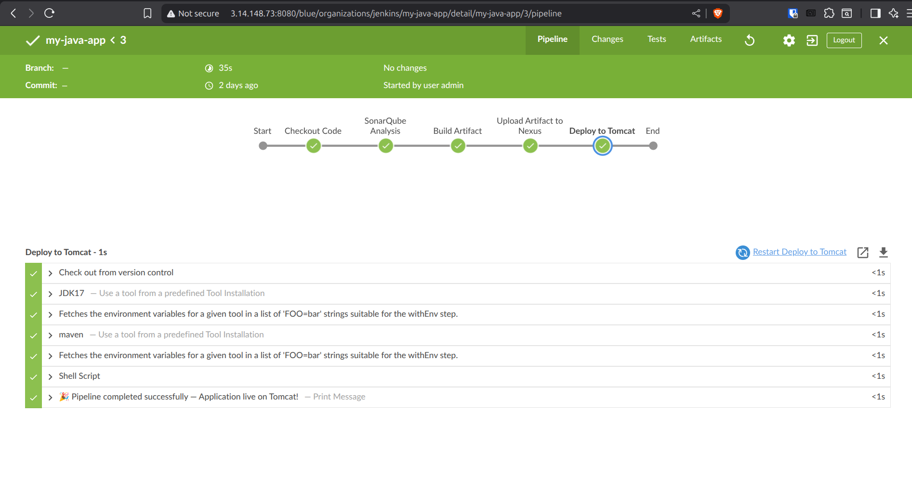
